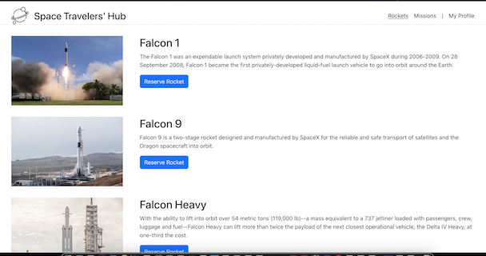

<a name="readme-top"></a>
# React space travellers group-project(Module 3)

<div align="center">
  
  <br/>

  <h3><b>space travellers group-project</b></h3>

</div>
<!-- TABLE OF CONTENTS -->

# 📗 Table of Contents

- [📗 Table of Contents](#-table-of-contents)
- [📖 Space Travelers Hub ](#-space-travelers-hub-)
  - [🛠 Built With ](#-built-with-)
    - [Tech Stack ](#tech-stack-)
    - [Key Features ](#key-features-)
      - [🔭 Future Features ](#-future-features-)
  - [🚀 Live Demo ](#-live-demo-)
  - [🚀 Project Presentation Video ](#-project-presentation-video-)
  - [💻 Getting Started ](#-getting-started-)
    - [Setup](#setup)
    - [Install](#install)
    - [Usage](#usage)
    - [Testing](#testing)
    - [Deployment](#deployment)
  - [👥 Authors](#-authors)
  - [🤝 Contributing ](#-contributing-)
  - [⭐️ Show your support ](#️-show-your-support-)
  - [🙏 Acknowledgments ](#-acknowledgments-)
  - [📝 License ](#-license-)

<!-- PROJECT DESCRIPTION -->

# 📖 space travellers group-project <a name="about-project"></a>

>  Space Travelers is a web application working with the real live data from the SpaceX API. Our task is to build a web application for a company that provides commercial and scientific space travel services. The application will allow users to book rockets and join selected space missions.

## 🛠 Built With <a name="built-with"></a>

### Tech Stack <a name="tech-stack"></a>

<details>
  <summary>Client</summary>
  <ul>
    <li><a href="https://reactjs.org/">React.js</a></li>
    <li>Redux</li>
    <li>React Router</li>
    <li><a href="https://html.com/">Html5</a></li>
    <li><a href="hhttps://www.w3schools.com/css/">CSS3</a></li>
    <li>JS</li>
    <li>ESLint</li>
    <li>StyleLints</li>
    <li>GitFlow</li>
    <li><a href="https://www.javascript.com/">ES6</a></li>
    <li>Webpack</li>
    <li>Jest</li>
  </ul>
</details>

<details>
  <summary>Server</summary>
  <ul>
    <li><a href="#">N/A</a></li>
  </ul>
</details>

<details>
<summary>Database</summary>
  <ul>
    <li><a href="#">N/A</a></li>
  </ul>
</details>

<!-- Features -->

### Key Features <a name="key-features"></a>

- **[Dynamically]**
- **[Git-flow]**
- **[Good-HTML-JS-and-CSS-practices]**
- **[ES6-modules]**
- **[react-Jest-tests]**
- **[react-Webpack]**

<p align="right">(<a href="#readme-top">back to top</a>)</p>

#### 🔭 Future Features <a name="future-features"></a>


<!-- LIVE DEMO -->

## 🚀 Live Demo <a name="live-demo"></a>


<p align="right">(<a href="#readme-top">back to top</a>)</p>

## 🚀 Project Presentation Video <a name="live-demo"></a>


<p align="right">(<a href="#readme-top">back to top</a>)</p>

<!-- GETTING STARTED -->

## 💻 Getting Started <a name="getting-started"></a>

To get a local copy up and running, follow these steps.

### Setup

Clone this repository to your desired folder:

```sh
  git clone https://github.com/MMGGYY66/space-travellers-group-project
```

### Install

Install this project with:

```sh
  npm install
```

### Usage

### Install

After cloning the repo you need to install de dependencies.
- Run this command in the project folder:
 <code>npm install</code>

To run the project, execute the following command:

- Builds the app for production to the build folder. It correctly bundles React in production mode and optimizes the build for the best performance. run:
 <code>npm run build</code>

 - Runs the app in the development mode. Open http://localhost:3000 to view it in the browser: run
 <code>npm start</code>

### Run tests

To run tests, run the following command:
 <code>npm test</code>### Testing

### Deployment


<p align="right">(<a href="#readme-top">back to top</a>)</p>

<!-- AUTHORS -->

## 👥 Authors

<a name="authors"></a>

👤 **Mohamed Gamil Eldimardash**

- GitHub: [@github](https://github.com/MMGGYY66)
- LinkedIn: [LinkedIn](https://www.linkedin.com/in/mohamed-eldimardash-0023a3b5/)
- Twitter: [twitter](https://twitter.com/MOHAMEDELDIMARd)
- Facebook: [facebook](https://www.facebook.com/MOHAMED.ELDIMARDASH/)

👤 ** Gerson Sanchez **

- GitHub: [@githubhandle](https://github.com/gealsanchez)
- Twitter: [@twitterhandle](https://twitter.com/gealsanchez)
- LinkedIn: [LinkedIn](https://www.linkedin.com/in/gerson-sanchez-88309b57/)

<p align="right">(<a href="#readme-top">back to top</a>)</p>


<!-- CONTRIBUTING -->

## 🤝 Contributing <a name="contributing"></a>

Contributions, issues, and feature requests are welcome!
Feel free to check the [issues page](https://github.com/MMGGYY66/space-travellers-group-project/issues).

<p align="right">(<a href="#readme-top">back to top</a>)</p>

<!-- SUPPORT -->

## ⭐️ Show your support <a name="support"></a>

If you like this project take the time to give a star, follow us and a feedback, we will appreciate it.

<p align="right">(<a href="#readme-top">back to top</a>)</p>

<!-- ACKNOWLEDGEMENTS -->

## 🙏 Acknowledgments <a name="acknowledgements"></a>

we would like to thank Microverse for giving us the chance to improve our coding.

<p align="right">(<a href="#readme-top">back to top</a>)</p>

<!-- LICENSE -->

## 📝 License <a name="license"></a>

This project is [MIT](https://github.com/MMGGYY66/space-travellers-group-project/blob/tests/MIT.md) licensed.

<p align="right">(<a href="#readme-top">back to top</a>)</p>
